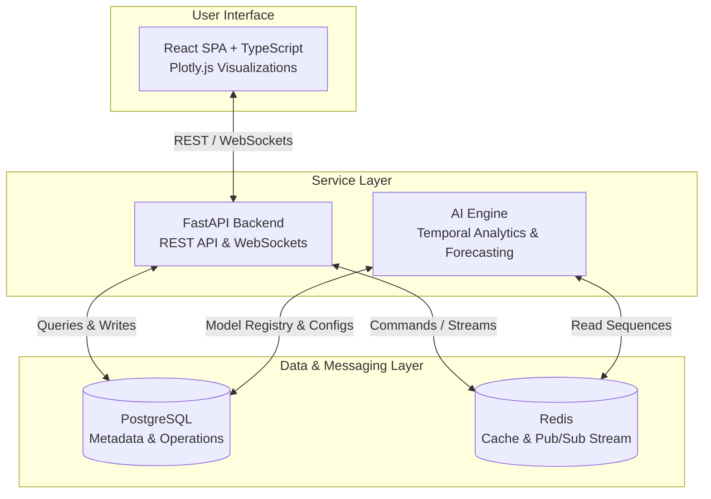

# ChronoShield AI 🛡️⏳

### Enterprise Temporal Anomaly Detection & Predictive Infrastructure Analytics

ChronoShield AI is a state-of-the-art, high-throughput, and scalable platform designed to detect temporal anomalies and perform predictive analytics on mission-critical system infrastructure. By leveraging advanced deep-learning temporal models (LSTM, Autoencoders) and a low-latency microservice architecture, ChronoShield AI identifies silent system degradation, predicts failure points, and prevents infrastructure disruptions before they impact business operations.

---

## 🏗️ System Architecture



---

## 📂 Monorepo Structure

```text
chronoshield-ai/
├── backend/            # FastAPI REST & WebSocket Microservice
│   ├── app/            # Main application structure (routes, core, db, etc.)
│   ├── Dockerfile      # Optimized multi-stage Python runner
│   └── requirements.txt# Core service dependencies
├── ai-engine/          # ML Pipeline, model definitions, training, and inference
│   ├── src/            # Core AI engines, data loaders, and model registry
│   ├── Dockerfile      # Optimized CUDA/CPU deep learning environment
│   └── requirements.txt# Machine learning libraries
├── frontend/           # React + Vite + TypeScript Client Dashboard
│   ├── src/            # UI components, React hooks, charts, and routing
│   ├── vite.config.ts  # Vite build optimizations
│   └── package.json    # Front-end dependencies & scripts
├── infrastructure/     # Orchestrations, Nginx reverse proxies, environment setups
│   ├── docker-compose.yml
│   └── nginx/          # Production reverse proxy configuration
├── configs/            # Global application config structures (YAML, XML, JSON)
├── docs/               # System architecture documentation, API specs, and runbooks
├── scripts/            # Bootstrap and development shell utilities
├── tests/              # Multi-component E2E integration test suites
├── datasets/           # Standard formats for temporal time-series datasets
├── logs/               # Operational logs directory
├── .gitignore          # Comprehensive monorepo gitignore
├── .env.example        # Master environment variables template
└── README.md           # Master platform documentation
```

---

## 🛠️ Technology Stack

- **Frontend**: React (18+) + Vite + TypeScript + Plotly.js for premium, sub-second latency data visualization. Styled with modern, glassmorphic dark-mode CSS tokens.
- **Backend API**: FastAPI (Python) for asynchronous, high-throughput database interactions, security, and low-latency websocket pushing.
- **AI Analytics**: PyTorch & PyDantic powered Python AI Engine optimized for temporal sequences (LSTM and autoencoder architectures).
- **Caching & Streams**: Redis for caching hot metrics, pub/sub communication channels, and windowed sequence streaming.
- **Database**: PostgreSQL for transactional metrics, user configurations, model metadata registry, and incident tracking.
- **Deployment**: Docker and Nginx reverse proxy routing.

---

## ⚡ Quick Start

### 1. Prerequisites
- **Docker & Docker Compose** (Highly Recommended)
- **Node.js** v18+ (for local frontend development)
- **Python** v3.10+ (for local backend and AI development)

### 2. Standard Local Bootstrap (Automated)
Run the bootstrapping script to initialize environments and dependencies for all services:
```bash
chmod +x scripts/bootstrap.sh
./scripts/bootstrap.sh
```

### 3. Running via Docker Compose
To build and spin up the complete platform in isolated containers:
```bash
docker compose -f infrastructure/docker-compose.yml up --build
```
Once initialized, the platform will be available at:
* **Frontend UI**: `http://localhost:80`
* **FastAPI Interactive Docs (Swagger)**: `http://localhost:8000/docs`
* **Healthcheck status API**: `http://localhost:8000/health`

---

## 🛡️ Modular Design & Coding Standards

1. **Strict Service Independence**: Avoid imports across microservices. Keep `backend/`, `ai-engine/`, and `frontend/` isolated. Use REST APIs or Redis streams for all inter-service communication.
2. **Environment Isolation**: Always use `pydantic-settings` (FastAPI) or `Vite Env Variables` (Frontend) to inject runtime configuration rather than hardcoding.
3. **Structured Logging**: Ensure all application events are outputted using structural JSON logging configurations mapping correct severity contexts (`INFO`, `WARNING`, `ERROR`).
4. **CSS Token Integrity**: When adding visual layers to the frontend, rely exclusively on design system tokens declared inside `index.css`.
