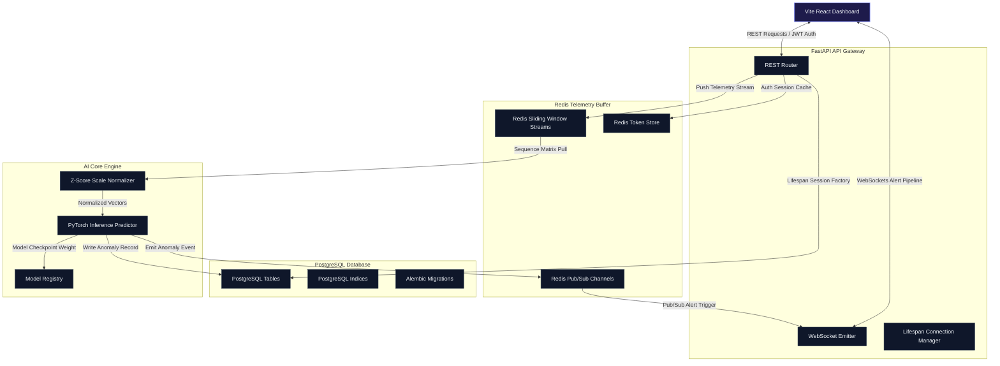
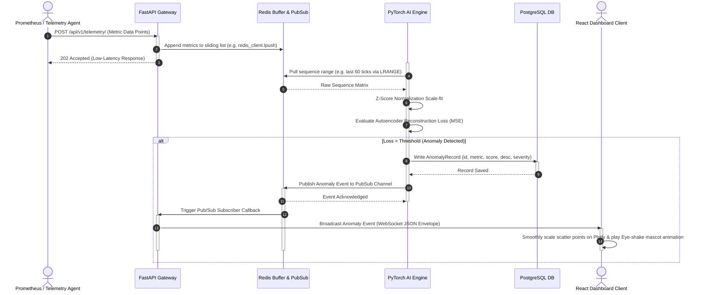
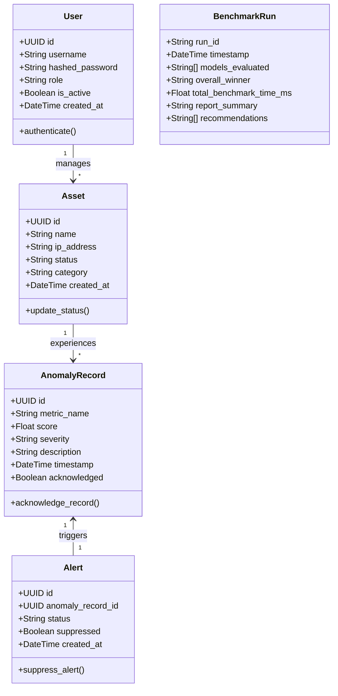

# ChronoShield AI: System Architecture Specification

This document provides a highly detailed architectural overview of the **ChronoShield AI** platform, explaining telemetry streams, message routing, neural network anomaly assessment, and downstream indexing strategies.

---

## 1. Core Architecture Overview

ChronoShield AI serves as an active telemetry operations center dashboard designed to identify system anomalies across time-series metrics:

---

## 2. Telemetry Ingestion & Real-Time Alert Broadcast Sequence

The platform ingests metric streams, runs neural network reconstructions, saves findings, and broadcasts alerts within sub-second latencies:

---

## 3. Core Domain Entity Model UML

Below is the entity-relationship class mapping representing database tables orchestrated by SQL Alchemy in the backend and reflected in the frontend schemas:

---

## 4. Core Modules

### 4.1 Frontend Operations (React + TypeScript)
- **State Layer**: Maintains low-overhead state triggers capturing WebSocket broadcasts.
- **Plotly Canvas**: Implements sub-second latency re-renders for sliding data windows, highlighting anomaly flags as discrete scatter markers overlaid on the telemetry curve.
- **Visual Design**: Cyber-dark Operations Room look-and-feel leveraging glassmorphism, responsive grid coordinates, and pulsing active state triggers.

### 4.2 API Layer (FastAPI)
- **Lifespan Manager**: Handles setup/teardown connections for database session factories and Redis connection pools.
- **WebSocket Gateway**: Broadsheet emitter pushing evaluated anomaly events to active UI clients.
- **Routing Modules**: Provides CRUD operations for logs, filters, user alerts, and model registries.

### 4.3 AI Pipeline (Python + PyTorch)
- **Temporal Ingestion**: Gathers metrics from Redis sliding window lists.
- **Data Normalizer**: Transforms sequence data using z-score scaler parameters calibrated during model fit.
- **Autoencoder Reconstruction**: Evaluates sequence vectors. If the mean squared error between input sequences and decodings surpasses standard sensitivity thresholds, it categorizes it as an anomaly.

### 4.4 Caching & Storage Layer (Redis & PostgreSQL)
- **Redis Cache**: Holds short-term telemetry sequence arrays. Executes pub/sub communication hooks to trigger AI assessment alerts.
- **PostgreSQL Database**: Acts as the transactional storage ledger, maintaining database indices of past incidents, user acknowledgements, settings, and ML weights checkpoints.
