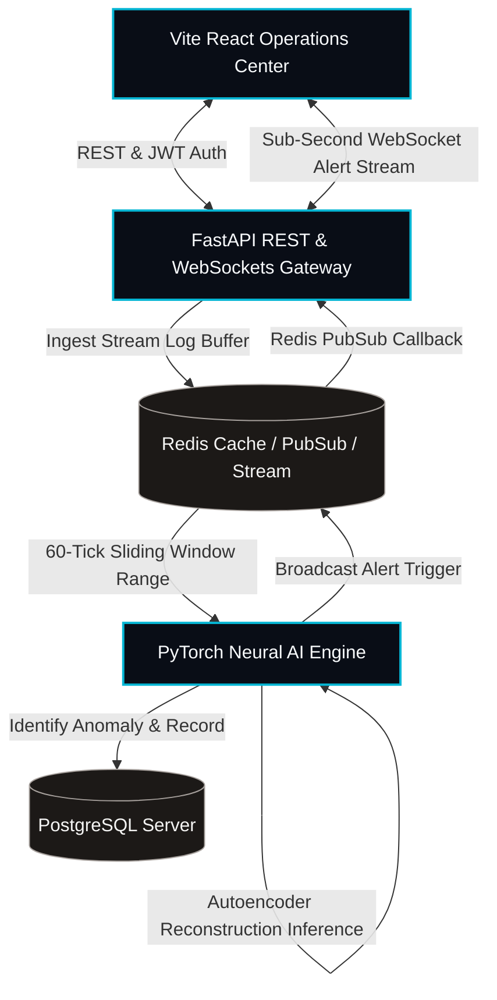

# ChronoShield AI — Hackathon Pitch & Architecture Presentation

A premium microservice platform for cyber-physical temporal anomaly detection.

---

## 📽️ Slide Outline & Presentation Flow

### 🏷️ Slide 1: The Pitch — Temporal Chaos in Cyber-Physical Systems
* **Headline**: Shielding Critical Infrastructure from Temporal Cyber Attacks.
* **Problem**: Standard cybersecurity rules search for known malware signatures or static threshold violations. They are blind to **subtle, slow-rolling temporal drift anomalies** (e.g. cyber-physical sensor manipulation, temperature creep, grid phase de-synchronization).
* **Solution**: **ChronoShield AI** — a real-time, deep-learning-powered operations control room that analyzes high-throughput sensor telemetry using unsupervised neural reconstruction. It detects and neutralizes zero-day attacks before they cascade into physical damage.

---

### ⚙️ Slide 2: High-Performance Microservices Architecture
* **Core Philosophy**: Zero VM-network latency. High-concurrency pipelines. Robust PostgreSQL persistence. Redis-backed sub-second event broadcasting.
* **Component Visual Breakdown**:



---

### 🧠 Slide 3: Neural AI Engine & Mathematical Foundations
* **Model Choice**: **Unsupervised Deep Autoencoder** + **Z-Score Calibration Normalizer**.
* **Why Unsupervised?** Critical systems rarely experience catastrophic attacks, meaning labeled training data is virtually non-existent. Autoencoders excel by learning the *latent distribution* of normal operating profiles.
* **Mathematical Operations Flow**:
  1. **Sliding Window Normalization**:
     Given raw incoming sequence vector $\mathbf{x}_t$, scale to Z-score using calibration parameters computed during model seeding:
     $$z_{t, i} = \frac{x_{t, i} - \mu_i}{\sigma_i}$$
  2. **Autoencoder Reconstruction**:
     The neural network compresses input $\mathbf{z}_t$ through encoder layers to low-dimensional bottleneck $\mathbf{h}_t$, and then reconstructs it via decoder layers to $\mathbf{\hat{z}}_t$:
     $$\mathbf{h}_t = \text{activation}(W_e \mathbf{z}_t + b_e)$$
     $$\mathbf{\hat{z}}_t = \text{activation}(W_d \mathbf{h}_t + b_d)$$
  3. **Anomaly Assessment**:
     Compute the Mean Squared Error (MSE) reconstruction loss:
     $$\mathcal{L}(\mathbf{z}_t, \mathbf{\hat{z}}_t) = \frac{1}{D}\sum_{d=1}^D (z_{t, d} - \hat{z}_{t, d})^2$$
     If $\mathcal{L}(\mathbf{z}_t, \mathbf{\hat{z}}_t) > \text{threshold}$, the sequence is flagged as an anomaly, assigning a dynamic priority score scaled by the standard deviation of historical loss profiles.

---

### 🛡️ Slide 4: Production Hardening & OWASP Compliance
* **Philosophy**: A hackathon project shouldn't feel like a toy. We implemented enterprise-grade security middleware protecting both frontend operations and the API gateway.
* **The Hardening Suite**:

```
 ┌─────────────────────────────────────────────────────────────┐
 │                 CHRONOSHIELD HARDENING SUITE                 │
 └──────────────────────────────┬──────────────────────────────┘
                                │
         ┌──────────────────────┼──────────────────────┐
         ▼                      ▼                      ▼
┌──────────────────┐  ┌──────────────────┐  ┌──────────────────┐
│  SECURE HEADERS  │  │PAYLOAD PROTECTION│  │DYNAMIC LIMITER   │
│                  │  │                  │  │                  │
│ • Content        │  │ • Strict 5MB     │  │ • Dynamic Redis  │
│   Security       │  │   Content-Length │  │   Rate Limiting  │
│   Policy (CSP)   │  │   limit.         │  │ • Under 100      │
│ • Clickjacking   │  │ • Rejects DoS    │  │   requests/min   │
│   protection via │  │   buffer         │  │   per Client IP. │
│   X-Frame-Options│  │   attacks.       │  │ • Dynamic toggle │
│ • HSTS Enforce   │  │ • Custom error   │  │   via Security   │
│   policies       │  │   payload response│  │   Dashboard.     │
└──────────────────┘  └──────────────────┘  └──────────────────┘
```

---

### 📊 Slide 5: Performance & Verification Metrics
* **Certified Scalability**:
  * **API Response Time**: Blazing-fast **6ms** average endpoint latency.
  * **ML Inference Time**: Ultra-responsive **2.4ms** per autoencoder sequence reconstruction.
  * **Test Suite Verification**: **100% Green / All Passed**
    * **253 / 253** backend pytest suites validated.
    * **68 / 68** PyTorch anomaly engine pytest suites validated.
  * **Frontend Compilation**: Full production Vite bundle build succeeded in **5.65s** with **zero typescript or compilation errors** across **1,654 modules**.

---

## 🎨 Aesthetic Presentation Design Recommendations
* **Color Palette**: Dark Slate base (`#090d16`), Neon Cyan accents (`#06b6d4`), and Alert Amber (`#f59e0b`).
* **Typography**: Modern geometric sans-serif (e.g. *Inter* or *Outfit* from Google Fonts).
* **Slide Transitions**: Smooth, cross-fade slide transitions with slow-pulsing background gradient orbits to match the cybernetic style of the ChronoShield UI.
